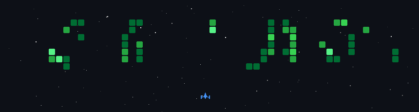

<h1 align="center">
    
</h1>

<h3 align="center">A passionate Data Science & AI Student from Vietnam 🇻🇳</h3>

 

 

  
🌱 I’m currently diving deep into <b>Optimization Algorithms, Physics Informed Neural Network, Deep Learning Architectures (Transformers, GANs, Mamba), and Advanced Time-Series Forecasting</b>.

  
  
🔭 My current research focuses on: 🧩 <b>Mathematical & Statistical Foundations of ML</b>, ⚡ <b>Multi-horizon Prediction Algorithms</b>, and 📊 <b>Sequential Temporal Data Modeling</b>.

  
  
⚡ Random quote: <b>To be ballin, you gotta b-all-in</b>

 

 
  
  <!--  -->
  

 

# 💻 Tech Stack:

 

 
# 📊 GitHub Stats:

  
  

  

  <h2> 🚀 GitHub Space Shooter 🚀 </h2>
   
  
   

    

